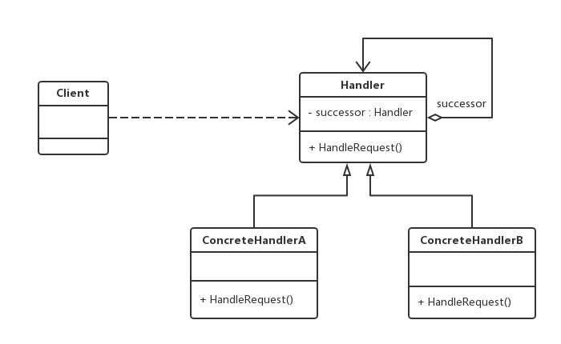

老版本问题：
 if (request.Amount < 5000) // 主任可审批该采购单
{
    HandleByDirector(request);
}
else if(request.Amount < 100000) // 副董事长可审批该采购单
{
    HandleByVicePresident(request);
}
else if (request.Amount < 500000) // 董事长可审批该采购单
{
    HandleByPresident(request);
}
else
{
    HandleByCongress(request); // 董事会可审批该采购单
}
无法随意新增角色和更改流程

职责链（Chain of Responsibility）模式：避免将请求发送者与接受者耦合在一起，让多个对象都有机会
接受请求，将这些对象连成一条链，并且沿着这条链传递请求，直到有对象处理它为止。职责链模式是一种
对象行为型模式
（1）Handler（抽象处理者）：定义了一个处理请求的接口，一般设计为抽象类，由于不同的具体处理者处理
请求的方式不同，因此在其中定义了抽象请求处理方法。**重点是抽象类里引用抽象类自己来表示下游对象**
（2）ConcreteHandler（具体处理者）：它是抽象处理者的子类，可以处理用户请求，它实现了在抽象处理者
中定义的抽象请求处理方法。在处理请求之前需要判断是否有相应的处理权限，如果可以则处理，否则则将请
求转发给后继者。
主要优点：
（1）使得一个对象无需知道是其他哪一个对象处理其请求，对象仅需知道该请求会被处理即可，且链式结构
由客户端创建 => 降低了系统的耦合度
（2）在系统中增加一个新的具体处理者无须修改原有系统源代码，只需要在客户端重新建立链式结构即可 => 
符合开闭原则
应用场景：
（1）有多个对象处理同一个请求且无需关心请求的处理对象时谁以及它是如何处理的 => 比如**各种审批流程**
（2）可以动态地指定一组对象处理请求，客户端可以动态创建职责链来处理请求，还可以改变链中处理者之间
的先后次序 => 比如各种流程定制
jdk:
java.util.logging.Logger#log()
javax.servlet.Filter#doFilter()