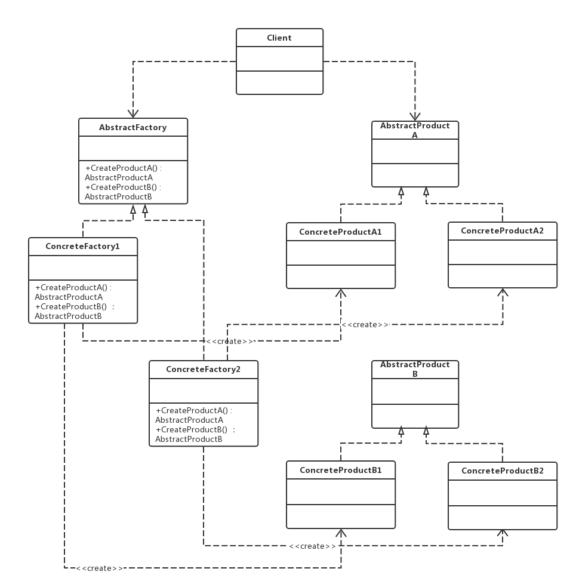

老版本问题：
1.使用工厂方法会导致系统越来越庞大，从而增加了系统的维护成本和运行开销，抽象工厂将一类
对象统一管理为产品族
2.抽象工厂与工厂方法最大的区别就在于，工厂方法模式针对的是一个产品等级结构，
而抽象工厂模式需要面对多个产品等级结构，一个工厂等级结构可以负责多个不同产品
等级中的产品对象的创建

抽象工厂（abstract factory）模式：抽象工厂模式提供一个创建一系列相关或相互依赖对象的接口，
而无须指定它们具体的类。抽象工厂模式又称为Kit模式，它是一种对象创建型模式
（1）Abstract Factory (抽象工厂角色)：声明了一组用于创建一族产品的方法，每一个方法对应一种产品。
（2）Concrete Factory (具体工厂角色)：实现了在抽象工厂中声明的创建产品的方法，生成一组具体产品，
这些产品构成了一个产品族。
（3）Abstract Product (抽象产品角色)：为每种产品声明接口，在抽象产品中声明了所有的业务方法。
（4）Concrete Product (具体产品角色)：定义具体工厂生产的具体产品对象，实现在抽象产品接口中声明的业务方法
主要优点：
  　当一个产品族中的多个对象被设计成一起工作时，它能够保证客户端始终只使用同一个产品族中的对象。
  　增加新的产品族很方便，无需修改已有系统，符合开闭原则。
应用场景：
　　用户无须关心对象的创建过程，需要将对象的创建和使用解耦 -> 这是所有工厂模式的使用前提
  　系统中有多余一个的产品族，而每次都只使用其中的某一种产品族。
jdk:
DocumentBuilderFactory newInstance()方法