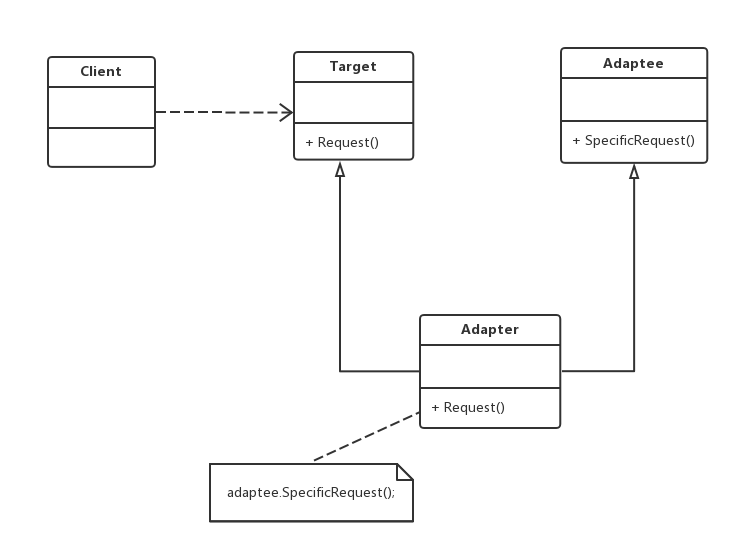

角色：
（1）Target（目标抽象类）：目标抽象类定义了客户所需要的接口，可以是一个抽象类或接口，
也可以是一个具体的类。
（2）Adapter（适配器类）：适配器可以调用另一个接口，作为一个转换器，对Adaptee和Target
进行适配。适配器类是适配者模式的核心，在适配器模式中，它通过继承Target并关联一个Adaptee
对象使二者产生联系。
（3）Adaptee（被适配者类）：适配者即被适配的角色，它定义了一个已经存在的接口，这个接口
需要适配，一般是一个具体类，包含了客户希望使用的业务方法，在某些情况下可能没有适配者类
的源代码

适配器（Adapter）模式：将一个接口转换成客户希望的另一个接口，使接口不兼容的那些类可以一起工作，
分为类适配器和对象适配器

使用时，适配器类在类中**引入被适配的类，然后在方法中强转**
主要优点：
（1）将目标类和适配者类解耦，从而无须修改原有结构（只需新增一个适配器类）
（2）增加了类的透明性（适配者类中的业务实现过程）和复用性（同一个适配者类可以在多个不同的
系统中复用）
（3）灵活性和可扩展性很好（借助配置文件和反射机制，可以方便地切换适配器，符合开闭原则）
应用场景：
（1）系统需要使用一些现有的类，而这些类的接口（例如方法名）不符合系统的需要，甚至没有这些类的源码。
（2）想要创建一个可以复用的类，用于一些彼此之间没有太大关联的类，包括一些可能在将来引进的类一起工作。
jdk:
InputStreamReader/OutputStreamWriter
inputStreamReader返回reader，但是构造需要inputStream，将reader和inputStream适配