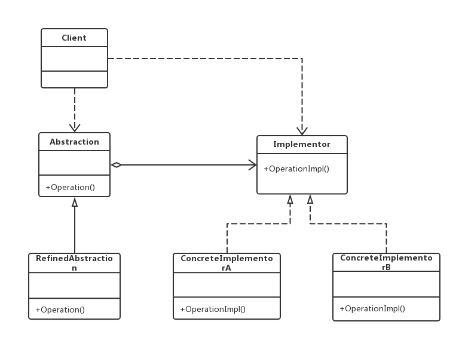
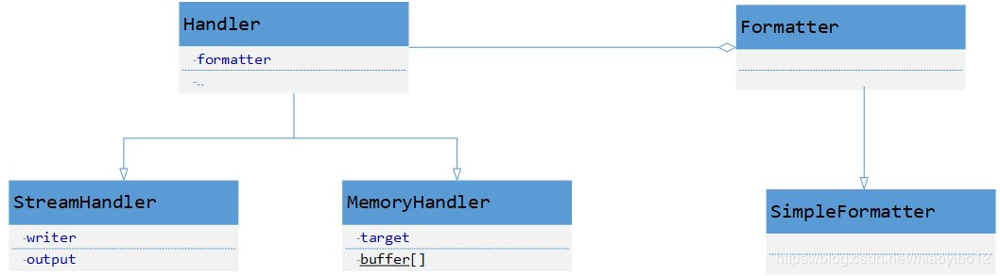

老版本问题：
1.涉及多维度变化的时候，例如图片分为png，jpg，操作系统windows，Linux，排列组合就会有4个子类，
类的继承过于复杂[图片](http://www.cnblogs.com/edisonchou/p/6978351.html)

桥接（Bridge）模式：将抽象部分与其实现部分分离，使得他们都可以独立地变化。它是一种对象结构型模式，
如果软件系统中某个类存在两个独立变化的维度，通过该模式可以将这两个维度分离出来，使两者可以独立扩展
1）Abstraction（抽象类）：用于定义抽象类的接口，其中定义了一个实现了Implementor接口的对象并可以维护该对象，
它与Implementor之间具有关联关系，运用组合来引入一个维度，子类继承来扩展另一个维度
2）RefinedAbstratction（扩充抽象类）：扩充由Abstraction定义的接口，通常情况下他不再是抽象类而是具体类，
实现了在Abstraction中声明的抽象业务方法，在RefinedAbstraction中可以调用在Implementor中定义的业务方法。
3）Implementor（实现类接口）：定义实现类的接口，一般而言，它不与Abstraction的接口一致。它只提供基本操作，
而Abstraction定义的接口可能会做更多更复杂的操作，存放一个维度，子类来实现。
4）ConcreteImplementor（具体实现类）：具体实现Implementor接口，在不同的ConcreteImplementor中提供基本操作的
不同实现，在程序运行时，ConcreteImplentor将替换其父类对象，提供给抽象类具体的业务操作方法。
主要优点：
  （1）分离抽象接口及其实现部分 -> 桥接模式使用“对象间的关联关系”解耦了抽象和实现之间固有的绑定关系，
  使得抽象和实现可以沿着各自的维度变化
  （2）取代多层继承方案 -> 极大地减少了子类的个数
　（3）提高了系统可扩展性 -> 在两个变化维度中任意扩展一个维度，都不需要修改原有系统，符合开闭原则
应用场景：
　　（1）一个类存在两个（或者多个）**独立变化的维度**，而且这两个（或者多个）维度都需要独立进行扩展。
  　（2）不希望使用继承或因为多层继承而导致系统中类的个数急剧增加。
  　（3）一个系统需要在抽象类和具体类之间增加更多的灵活性，避免在两个层次之间建立静态继承关系，
  通过桥接可以使它们在抽象层建立一个关联关系。
jdk:
java.util.logging
