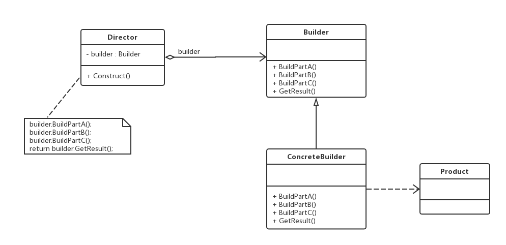

老版本问题：
1.建造者模式与抽象工厂模式有点相似，但是建造者模式返回一个完整的复杂产品，而抽象工厂模式则返回
一系列相关的产品。如果将抽象工厂模式看成一个汽车配件生产厂，生成不同类型的汽车配件，那么建造者
模式则是一个汽车组装厂，通过对配件进行组成返回一辆完整的汽车

建造者模式（Builder）：将一个复杂对象的构建与它的表示相分离，使得同样的构建过程可以创建不同
的表示。建造者模式是一种对象创建型模式
1）Builder（抽象建造者）：为创建一个产品对象的各个部件指定抽象接口，在其接口中一般包含两类方法：
一类是BuildPartX()，用于创建复杂对象的各个部件；另一类是GetResult()，用于返回生成好的复杂对象。
它就可以是抽象类，也可以是接口。
2）ConcreteBuilder（具体建造者）：实现了Builder接口，即实现了各个部件的具体构造和装配方法，
定义并明确其所创建的复杂对象。
3）Product（产品角色）：被构建的复杂对象，包含多个组成部件。
4）Director（指挥者）：负责安排复杂对象的建造次序，指挥者与抽象建造者之间存在关联关系，可以在
其Construct()方法中调用建造者对象的部件构造和装配方法，完成复杂对象的建造。因此，客户端只需要
和指挥者进行交互，这也确保了单一职责
主要优点：
  （1）客户端不需要知道产品内部的组成细节，将产品本身与产品的创建过程解耦，使得相同的创建过程
  可以创建不同的产品对象。
  （2）具体建造者相对独立，增加新的具体建造者无需修改原有类库的代码，系统扩展比较方便，符合开闭原则。
  （3）可以更加精细地控制产品的创建过程 -> 将复杂产品的创建步骤分解在不同的方法中，使得创建过程
  更加清晰，也更方便使用程序来控制创建过程
应用场景：
　　（1）需要生成的产品对象由复杂的内部结构，这些产品对象通常包含多个成员变量。
  　（2）需要生成的产品对象的属性**相互依赖，需要指定其生成顺序**。
  　（3）隔离复杂对象的创建和使用，并使得相同的创建过程可以创建不同的产品。
jdk:
java.lang.StringBuilder
public StringBuilder append(String str)方法