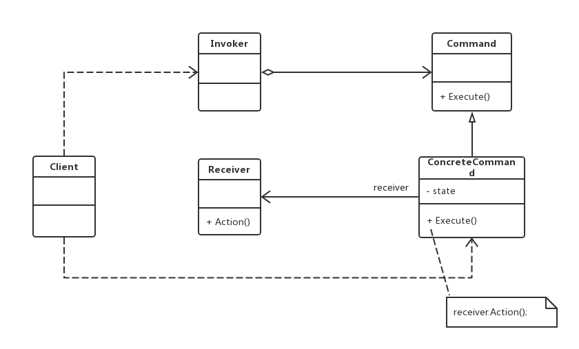

老版本问题：
public class FunctionButton
{
    private HelpHandler handler;
    public void OnClick()
    {
        handler = new HelpHandler();
        handler.Display();
    }
}
（1）请求发送者和请求接收者存在直接调用 => 耦合度太高！更换请求接收者必须修改发送者的源代码！
（2）FunctionButton类在设计和实现时功能已被固定 => 增加新的请求接收者要么修改FunctionButton类要么
新增一个新的请求接收者类
（3）用户无法按照自己的需要来设置某个功能键的功能 => 无法在修改源代码情况下更换功能，缺乏灵活性！

**相当于本来的对象A中包含B，C方法拆分成了AB命令和AC命令**
命令（Command）模式：将一个请求封装为一个对象，从而可以用不同的请求对客户进行参数化；对请求排队或者
记录请求日志，以及支持可撤销的操作。命令模式是一种对象行为型模式，其别名为动作（Action）模式或事物
（Transaction）模式。
（1）Command（抽象命令类）：一个抽象类或接口，声明了执行请求的Execute()方法，通过这些方法可以调用请求
接收者的相关操作。
（2）ConcreteCommand（具体命令类）：具体命令类是抽象命令类的子类，实现了抽象命令类中声明的方法。在实现
Execute()方法时，将调用接收者对象的相关操作（Action）。
（3）Invoker（调用者）：请求发送者，通过命令对象来执行请求。
（4）Receiver（接收者）：接收者执行与请求相关的操作，它具体实现对请求的业务处理。
主要优点：
（1）**降低了系统的耦合度** => 请求发送者与接受者不存在直接引用
（2）方便地增加新的命令到系统中 => 无须修改源代码，从而符合开闭原则
但是可能会导致某些系统有过多的具体命令类，因为一个方法一个命令类
控制却很简单。
应用场景：
系统需要将请求调用者和请求接收者解耦 
jdk:
java.lang.Runnable
所有对Runable接口的实现类
类功能：实现Runable接口的类，可以被线程执行。
如果体现了命令模式：通过实现Runable接口的类，将请求封装为一个对象，对请求排队或记录请求日志，
以及支持可撤销操作。允许接受请求的一方决定是否要否决请求，最重要一点就是：命令模式把请求一个
操作的对象和怎么执行一个操作的对象解耦。这就是Excutor框架执行实现Runable接口任务类的体现