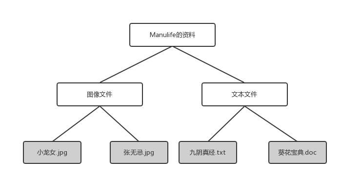
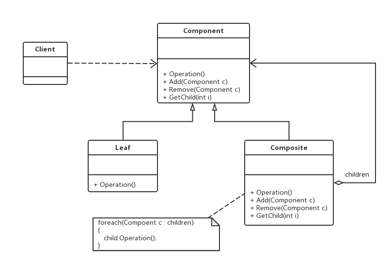

老版本问题：

（1）文件类Folder的设计和实现很复杂，需要定义多个集合存储不同类型的成员，存在大量的冗余代码
（2）系统没有提供抽象层，客户端代码必须有区别地对待充当容器的文件夹Folder和充当叶子的ImageFile和
TextFile，无法统一对它们进行处理。
（3）系统的灵活性和可扩展性差，如果需要增加新的类型的叶子和容器都需要对原有代码进行修改

组合（Composite）模式：组合多个对象形成**树形结构**以表示具有“整体-部分”关系的层次结构。组合模式对
单个对象（即叶子对象）和组合对象（即容器对象）的使用具有一致性，组合模式又可以称为“部分-整体”
（1）Component（抽象构件）：它是接口或抽象类，为叶子构件和容器构件对象声明接口，在该角色中可以包含
所有子类共有行为的声明和实现。在抽象构件中定义了访问及管理它的子构件的方法，例如增加子构件、删除
子构件、获取子构件等。
（2）Leaf（叶子构件）：它在组合模式中表示叶子结点对象，叶子结点没有子节点，它实现了在抽象构件中
定义的行为。相当于文件
（3）Composite（容器构件）：它在组合模式中表示容器节点对象，容器节点包含子节点，其子节点可以使叶子
结点，也可以是容器节点，它提供一个集合用于存储子节点，实现了在抽象构件中定义的行为。相当于文件夹
主要优点：
（1）增加新的容器构件和叶子构件都十分方便，无需对现有类库代码进行任何修改，符合开闭原则。
（3）为树形结构的面向对象实现提供了灵活地解决方案，可以形成复杂的树形结构，但对树形结构的
控制却很简单。
应用场景：
  　（1）在一个使用面向对象语言开发的系统中需要处理一个**树形结构**。
jdk:
java.util.List#addAll(Collection)