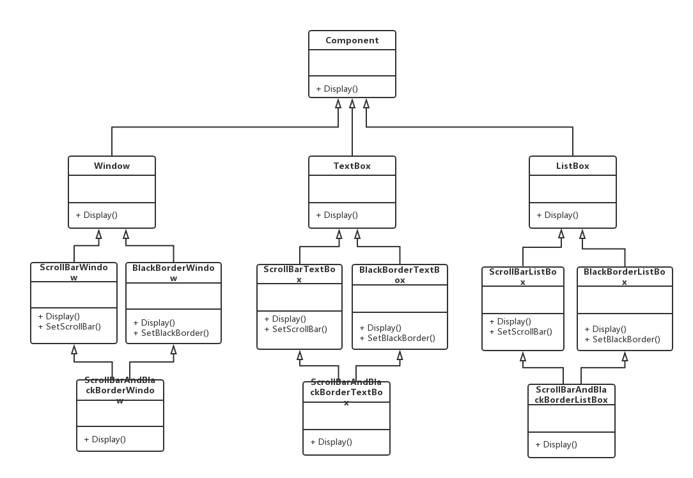
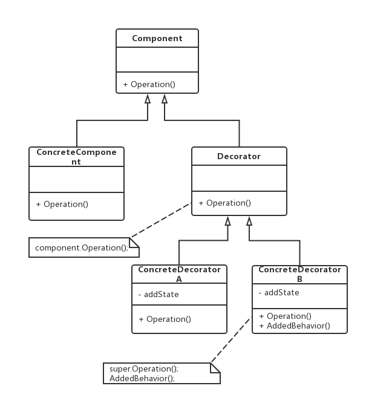
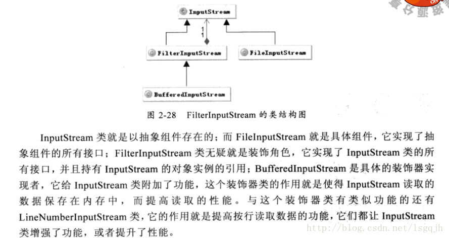

老版本问题：

（1）系统扩展麻烦，在C#/Java中根本无法实现（不支持多继承）。
（2）代码重复，不利于对系统进行修改和维护。
（3）系统庞大，类的数量非常多。

装饰（Decorator）模式：动态地给一个对象增加一些额外的职责，就增加对象功能来说，装饰模式远比生成子类
实现更加灵活。装饰模式是一种对象结构型模式
（1）Component （抽象构件）：具体构件和抽象装饰类的基类，声明了在具体构建中实现的业务方法。
（2）ConcreteComponent（具体构件）：抽象构件的子类，用于定义具体的构件对象，实现了在抽象构件中
声明的方法，装饰器可以给它增加额外的职责（方法）。
（3）Decorator（抽象装饰类）：它也是抽象构件类的子类，用于给具体构件增加职责，但是具体职责在其子类
中实现。
（4）ConcreteDecorator（具体装饰类）：抽象装饰类的子类，负责向构件添加新的职责
主要优点：
（1）对于扩展一个对象的功能，装饰模式比继承更加灵活 => 不会导致类的个数急剧增加！
（2）可以**对一个对象进行多次装饰**，从而创造出很多不同行为的组合 => 得到功能更为强大的对象！
（3）具体构件类与具体装饰类可以独立变化，可以根据需要增加新的具体构建和具体装饰 => 原有代码无需修改，
符合开放封闭原则！
应用场景：
  　（1）在不影响其他对象的情况下，想要动态地、透明地给单个对象添加职责 => 采用装饰模式吧！
    （2）当不能采用继承的方式对系统进行扩展或采取继承不利于系统扩展和维护时 => 采用装饰模式吧！
jdk:

InputStream is=new BufferedInputStream(new FileInputStream(new File("")));
BufferedInputStream继承自filterInputStream，然后filterInputStream继承自inputStream
FileInputStream同继承自inputstream
filterInputStream作为装饰器类，为其他类提供额外的方法，此处
BufferedInputStream(filterInputStream的子类)为FileInputStream提供了缓存的装饰

装饰器模式和代理模式不同：
装饰器模式关注于在一个对象上动态的添加方法，然而代理模式关注于控制对对象的访问。换句话说，
用代理模式，_代理类（proxy class）可以对它的客户隐藏一个对象的具体信息_。因此，当使用代理模式的
时候，我们常常在一个代理类中创建一个对象的实例。并且，当我们使用装饰器模式的时候，我们通常的
做法是将原始对象作为一个参数传给装饰者的构造器。
我们可以用另外一句话来总结这些差别：使用代理模式，代理和真实对象之间的的关系通常在编译时就已经
确定了，而装饰者能够在运行时递归地被构造

所有类都最终继承自抽象构件，例子中调用方式时，对象们相当于形成了一个**链表，自下而上的依次调用**，
而非归于一个类的属性