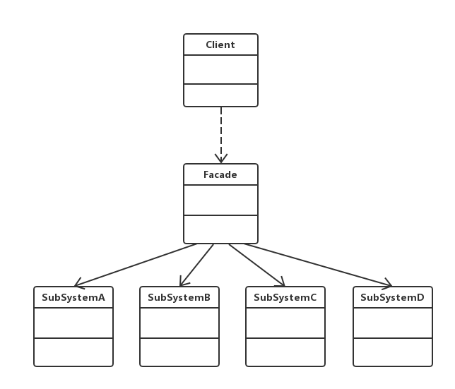

老版本问题：
（1）A、B与C类经常作为一个整体同时出现，但是如果按照普通方案进行设计和实现，在每一次使用
这3个类时，客户端代码都需要与它们逐个进行交互，导致客户端代码较为复杂，且在每次使用它们时
很多代码都会重复出现。
（2）如果需要更换A类，则所有使用该文件加密模块的代码都需要进行修改，系统维护难度增大，
灵活性和可扩展性较差。

外观（Facade）模式：外部与一个子系统的通信通过一个统一的外观角色进行，为子系统中的一组接口
提供一个一致的入口，外观模式定义了一个高层接口，这个接口使得这一子系统更加容易使用
（1）Facade（外观角色）：在客户端可以调用这个角色的方法，在外观角色中可以知道相关的子系统
的功能和责任；在正常情况下，它将所有从客户端发来的请求委派到相应的子系统中去，传递给相应
的子系统对象处理。
（2）SubSystem（子系统角色）：在软件系统中可以有一个或者多个子系统角色，每一个子系统可以
不是一个单独的类，而是一个类的集合，它实现子系统的功能；子系统并不知道外观（又称为门面）
的存在，对于子系统而言，外观角色仅仅是另一个客户端而已
主要优点：
　   1）对客户端屏蔽了子系统组件，减少了客户端需要处理的对象数量并且使得子系统使用起来更加容易。
     2）实现了子系统与客户端之间松耦合。
     3）提供了一个访问子系统的统一入口，并不影响客户端直接使用子系统。
应用场景：
　　（1）想要为访问一系列复杂的子系统提供一个**统一的简单入口** => 使用外观模式吧！
　　（2）客户端与多个子系统之间存在很大的依赖性，引入外观类可以将子系统和客户端解耦
　　（3）在层次化结构中，可以使用外观模式定义系统中每一层的入口，层与层之间不直接产生
联系 => 通过外观类建立联系，降低层与层之间的耦合度！
jdk:
javax.faces.context.ExternalContext,内部使用了ServletContext, HttpSession, HttpServletRequest,
 HttpServletResponse等等