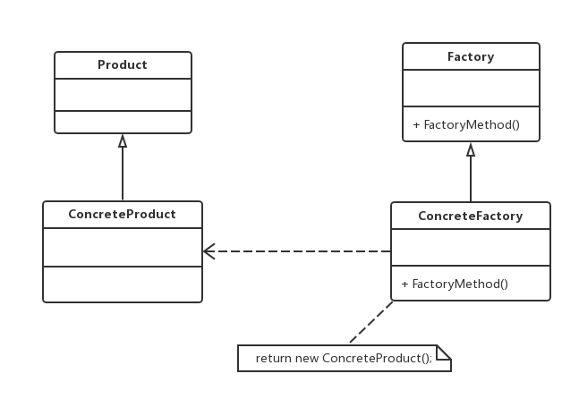
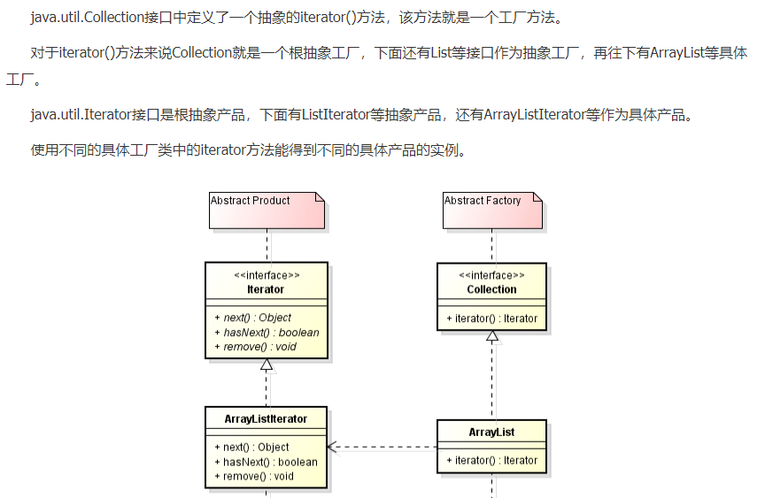

老版本问题：
// 简单工厂方法
    public static ILogger CreateLogger(string args)
    {
        if (args.Equals("db", StringComparison.OrdinalIgnoreCase))
        {
            ILogger logger = new DatabaseLogger();
            return logger;
        }
        else if(args.Equals("file", StringComparison.OrdinalIgnoreCase))
        {
            ILogger logger = new FileLogger();
            return logger;
        }
        else
        {
            return null;
        }
    }
工厂类过于庞大！包含了大量的if-else代码，维护和测试的难度增大不少。
系统扩展不灵活，如果新增类型的日志记录器，必须修改静态工厂方法的业务逻辑

工厂方法（Factory Method）模式：定义一个用于创建对象的接口，让子类决定将哪一个类实例化。
工厂方法模式让一个类的实例化延迟到其子类。工厂方法模式又简称为工厂模式，也可称为多态工厂模式，
它是一种创建型模式(工厂和产品都拆分为接口和实现)
（1）Product（抽象产品）：定义产品的接口，是工厂方法模式所创建的对象的超类，也就是产品对象的公共父类。
（2）ConcreteProduct（具体产品）：它实现了抽象产品接口，某种类型的具体产品由专门的具体工厂创建，
具体工厂和具体产品之间一一对应。
（3）Factory（抽象工厂）：抽象工厂类，声明了工厂方法，用于返回一个产品。
（4）ConcreteFactory（具体工厂）：抽象工厂的子类，实现了抽象工厂中定义的工厂方法，并可由客户端调用，
返回一个具体产品类的实例
主要优点：
　   工厂方法用于创建客户所需要的产品，还向客户隐藏了哪种具体产品类将被实例化这一细节。
因此，用户只需要关心所需产品对应的工厂，无须关心创建细节。
     在系统中加入新产品时，无需修改抽象工厂和抽象产品提供的接口，也无须修改客户端，
还无须修改其他的具体工厂和具体产品，而只要加入一个具体工厂和具体产品就可以了。
因此，系统的可扩展性得到了保证，符合开闭原则。
应用场景：
　　客户端不知道其所需要的对象的类。在工厂方法模式中，客户端不需要知道具体产品类的类名，
只需要知道所对应的的工厂即可，具体的产品对象由具体工厂创建，可将具体工厂的类名存储到配置
文件或数据库中。
    抽象工厂类通过其子类来指定创建哪个对象。在工厂方法模式中，
抽象工厂类只需要提供一个创建产品的接口，而由其子类来确定具体要创建的对象，
利用面向对象的多态性和里氏替换原则，在程序运行时，子类对象将覆盖父类对象，从而使得系统易于扩展
jdk:
