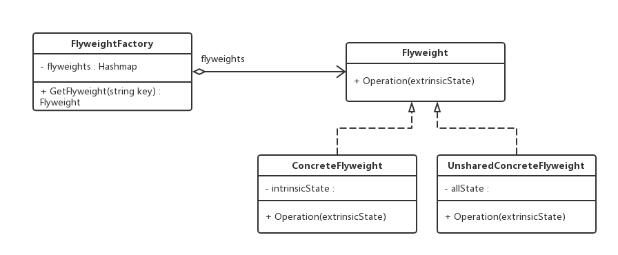

老版本问题：
围棋棋盘中包含大量的黑子和白子，它们的形状、大小都一模一样，只是出现的位置不同而已。如果将
每一个棋子都作为一个独立的对象存储在内存中，将可能导致该围棋软件在运行时所需要的内存空间较大,
所以将白子和黑子作为两个对象，颜色为内部状态，位置为外部状态

享元（Flyweight）模式：运用共享技术有效地支持大量细粒度对象的复用。系统只使用少量的对象，而这些对象
都很相似，状态变化很小，可以实现对象的多次复用。由于享元模式要求能够共享的对象必须是细粒度对象，因此
它又称为轻量级模式，是一种结构型模式
（1）Flyweight（抽象享元类）：一个接口或抽象类，声明了具体享元类的**公共**方法。
（2）ConcreteFlyweight（具体享元类）：实现了抽象享元类，其实例称为享元对象。
（3）UnsharedConcreteFlyweight（非共享具体享元类）：并不是所有的抽象享元类的子类都需要被共享，**不能
被共享**的子类可设计为费共享具体享元类。
（4）FlyweightFactory（享元工厂类）：用于创建并管理享元对象，一般设计为一个存储“Key-Value”键值对的
集合（可以结合工厂模式设计）。其作用就在于：提供一个用于存储享元对象的享元池，当用户需要对象时，首先
从享元池中获取，如果享元池中不存在，那么则创建一个新的享元对象返回给用户，并在享元池中保存该新增对象
主要优点：
　   可以极大减少内存中对象的数量，使得相同或相似对象在内存中只有一份
应用场景：
　　（1）一个系统有大量相同或相似的对象，造成了系统内存的大量损耗 => 赶紧使用享元模式吧！
  　（2）对象的大部分状态都可以外部化，可以将这些外部状态传入对象中。
  　（3）要维护享元模式，需要耗费一定的系统资源，因为在需要时会多次重复使用才值得使用享元模式了！
jdk:
java.lang.Integer(其它基本类型包装类(除去Float,Double)也如此,还有BigDecimal)
Integer.valueOf()方法
当基本正数数据类型在装箱为Integer类型时，0~127之间的数字装箱后会被*缓存*起来
同时利用了享元模式的还有String这个类，因为生存的每个字符串都是不可变的
 原型是创建过程复杂，直接内存复制。享元是需要的对象太多，通过复用来减少内存消耗
 原型模式：减少类class的数量，用对象来代替类（这些对象**内部属性一致**）
 原型模式通过Clone的方式来重复利用已创建的对象，享元模式通过分离外部状态和内部状态来
 实现对象的复用，但原型模式核心在于克隆，而享元模式在于内部状态(共享)，和独立的外部状态(非共享)