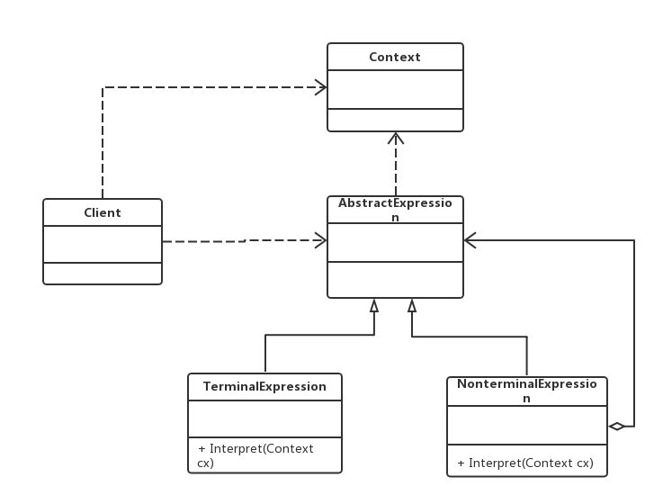

老版本问题：
主要用于描述如何使用面向对象语言构成一个简单的**语言解释器**

解释器（Interpreter）模式：定义一个语言的文法，并且建立一个解释器来解释该语言中的句子，这里
的“语言”是指使用规定格式和语法的代码。解释器模式是一种行为型模式
（1）AbstractExpression（抽象表达式）：声明了抽象的解释操作；
（2）TerminalExpression（终结符表达式）：抽象表达式的子类，实现了与文法中的终结符相关联的解释操
作，在句中的每一个终结符都是该类的一个实例，存储*最终变量*；
（3）NonterminalExpression（非终结符表达式）：抽象表达式的子类，实现了文法中非终结符的解释操作，
由于在非终结符表达式中可以包含终结符表达式，也可以继续包含非终结符表达式，因此其解释操作一般通过
递归完成，存储*中间表达式*。
（4）Context（环境类）：又称为上下文类，用于存储解释器之外的一些*全局信息*，通常它临时存储了需要解
释的语句。
主要优点：
（1）易于改变和扩展文法 => 通过继承来改变或扩展
（2）增加新的解释表达式较为方便 => 只需对应新增一个新的终结符或非终结符表达式，原有代码无须修改，
符合开闭原则！
应用场景：
（1）可以将一个需要解释执行的语言中的句子表示为一个抽象语法树
（2）一些重复出现的问题可以用一种简单的语言来进行表达
（3）一个语言的文法较为简单
（4）_执行效率不是关键问题_ => 高效的解释器通常不是通过直接解释抽象语法树来实现的
jdk:
java.util.Pattern
java.text.Format
类功能：此抽象类用于格式化一些格式敏感的信息，如：日期，信息，数字等。
实现方式：此类定义了一些方法，用于：将格式敏感的信息转为String。
