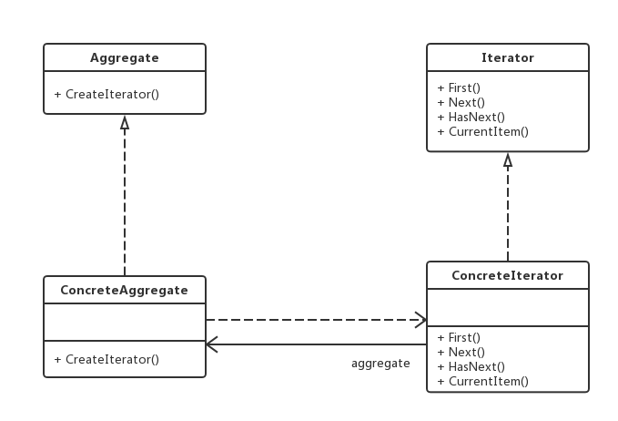

老版本问题：
聚合对象拥有两个职责：一是存储数据，二是遍历数据。从依赖性来看，前者是聚合对象的基本职责，而后者
既是可变化的又是可分离的。因此，可以将**遍历数据的行为从聚合对象中分离出来**

迭代器（Iterator）模式：提供一种方法来访问聚合对象，而不用暴露这个对象的内部表示，其别名为游
标（Cursor）。迭代器模式是一种对象行为型模式
（1）Iterator（抽象迭代器）：定义了访问和遍历元素的接口，声明了用于遍历数据元素的方法。
（2）ConcreteIterator（具体迭代器）：它实现了抽象迭代器接口，完成对聚合对象的遍历。
（3）Aggregate（抽象聚合类）：用于存储和管理元素对象，声明一个CreateIterator()方法用于创建一个
迭代器对象，充当抽象迭代器工厂角色。
（4）ConcreteAggregate（具体聚合类）：实现了在抽象聚合类中声明的CreateIterator()方法，返回一个
对应的具体迭代器ConcreteIterator实例
主要优点：
（1）支持以不同方式遍历一个聚合对象，在同一个聚合对象上可以定义多种便利方式。
（2）增加新的聚合类和迭代器类都很方便 => 无须修改原有代码，符合开闭原则。
但是资源消耗过大
应用场景：
（1）访问一个聚合对象的内容而无须暴露它的内部表示。
（2）需要为一个聚合对象**提供多种遍历方式**。
（3）重点 => 该模式在java中可以使用iterable和iterator
jdk:
java.util.Iterator
java.util.Enumeration
提供一个一致的方法来顺序访问集合中的对象，这个方法与底层的集合的具体实现无关。
