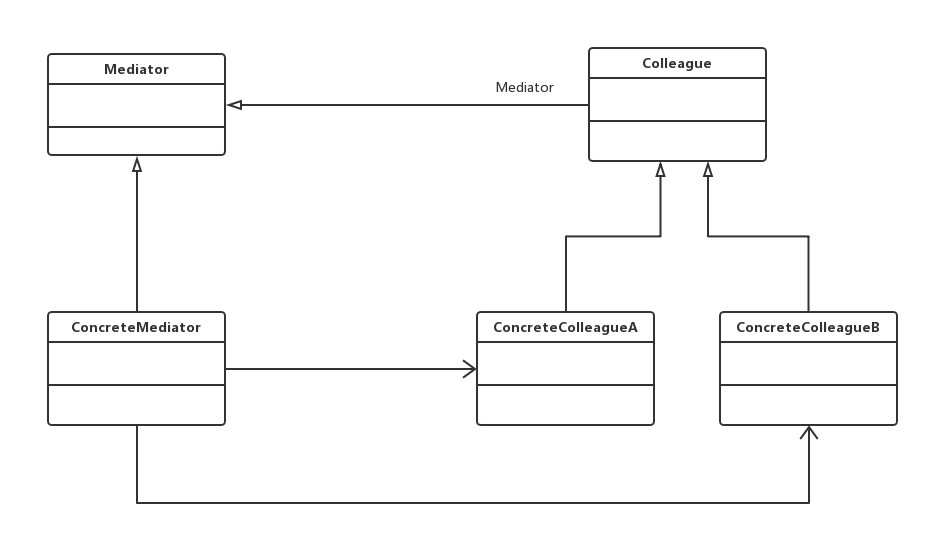

老版本问题：
使用QQ群，一个用户就可以向多个用户发送相同的信息和文件，从而无需一一发送，节省大量时间。通过引入
群的机制，极大地减少系统中用户之间的两两通信，某些类/对象之间的相互调用关系错综复杂，类似于QQ用户
之间的关系，此时，特别需要一个类似“QQ群”一样的中间类来协调这些类/对象之间的复杂关系

中介者（Mediator）模式：用一个中介对象来封装一系列的对象交互，中介者使各对象不需要显示地相互引用，
从而使其耦合松散，而且可以相对独立地改变它们之间的交互。中介者模式又称为调停模式，它是一种对象行为
型模式，**同事间消息传递由中介者控制**
（1）Mediator（抽象中介者）：它定义了一个接口，该接口用于与各同事对象之间进行通信。
（2）ConcreteMediator（具体中介者）：它实现了接口，通过协调各个同事对象来实现协作行为，维持了各个
同事对象的引用。
（3）Colleague（抽象同事类）：它定义了各个同事类公有的方法，并声明了一些抽象方法来供子类实现，同时
维持了一个对抽象中介者类的引用，其子类可以通过该引用来与中介者通信。
（4）ConcreteColleague（具体同事类）：抽象同事类的子类，每一个同事对象需要和其他对象通信时，都需要
先与中介者对象通信，通过中介者来间接完成与其他同事类的通信。
主要优点：
（1）简化了对象之间的交互，它用**中介者和同事的一对多交互替代了原来同事之间的多对多交互**。
（2）将各同事对象解耦，可以独立地改变和复用每个同事和中介者，增加新的中介和同事很方便，符合开闭原则。
（3）可以减少大量同事子类的生成，改变同事行为只需要生成新的中介者子类即可。
应用场景：
（1）系统中对象之间存在复杂的引用关系 => 系统结构混乱且难以理解
（2）一个对象由于引用了其他很多对象并且直接和这些对象通信 => 难以复用该对象
（3）想要通过一个中间类来封装多个类的行为又不想生成太多子类 => 引入中介者即可实现
jdk:
java.util.concurrent.Executor接口
定位：通过使用一个中间对象来进行消息分发以及减少类之间的直接依赖
如何体现 ：Executor框架将工作单元和执行机制解耦和。java多线程程序通常把应用分解为多个任务，然后
Executor框架将这些任务映射为固定数量的线程；在底层，操作系统内核将这些线程映射到硬件CPU上。
