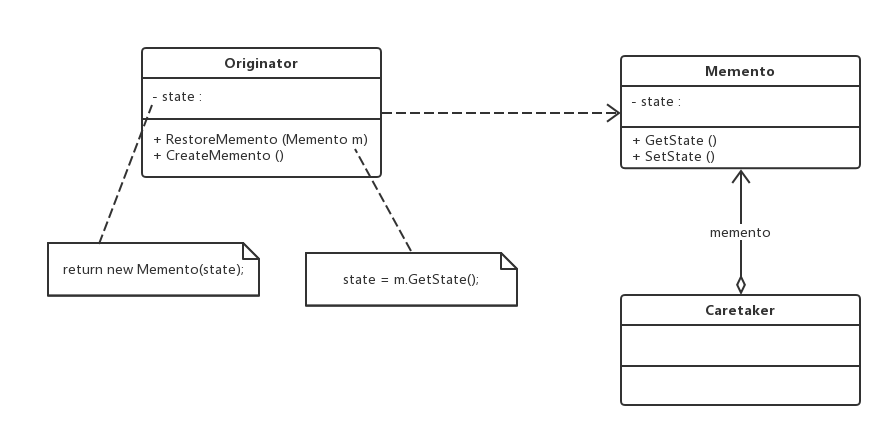

老版本问题：
用于撤销，让系统恢复到某个历史状态

备忘录（Memento）模式：在不破坏封装的前提下，捕获一个对象的内部状态，并在该对象之外保存这个
状态，这样可以在以后将对象恢复到原先保存的状态。它是一种对象行为型模式，其别名为Token
（1）Originator（原发器）：它是一个普通类，可以创建一个备忘录，并存储其当前内部状态，也可以使用
备忘录来恢复其内部状态，一般需要保存内部状态的类设计为原发器。
（2）Memento（备忘录）：存储原发器的状态，根据原发器来决定保存哪些内部状态，**和原发器相同结构**。
（3）Caretaker（负责任）：负责任又称为管理者，它负责保存备忘录，但是不能对备忘录的内容进行操作或
检查。
主要优点：
（1）提供了一种状态恢复的实现机制，使得用户可以方便地回到一个特定的历史步骤。
（2）实现了对信息的封装，一个备忘录对象是一种原发器对象状态的表示，不会被其他代码所改动。
但是资源消耗过大
应用场景：
（1）需要保存一个对象在某一个时刻的全部状态或部分状态状态，以便需要在后面需要时可以
**恢复到先前的状态**。
（2）防止外界对象破坏一个对象历史状态的封装性，避免将对象历史状态的实现细节暴露给外界对象。
jdk:
java.util.Date
生成对象状态的一个快照，以便对象可以恢复原始状态而不用暴露自身的内容。Date对象通过自身内部的
一个long值来实现备忘录模式。
