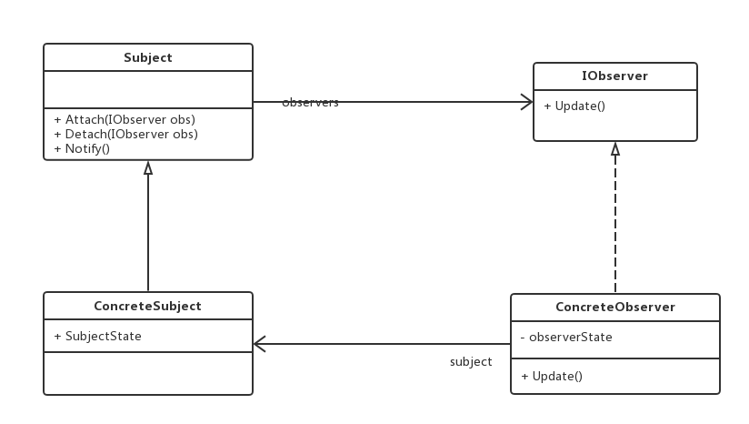

老版本问题：
用于发布/订阅模型

观察者（Observer）模式：定义对象之间的一种一对多依赖关系，使得当每一个对象状态发生改变时，
其相关依赖对象皆得到通知并被自动更新
（1）Subject（抽象目标）：又称为主题，是被观察的对象。
（2）ConcreteSubject（具体目标）：抽象目标的子类，通常包含有经常发生改变的数据，当它的状态
发生改变时，向其各个观察者发出通知。
（3）Observer（抽象观察者）：观察者将对观察目标的改变做出反应。
（4）ConcreteObserver（具体观察者）：具体观察者中维持一个指向具体目标对象的引用，它用于存储
具体观察者的有关状态，这些状态需要和具体目标地状态保持一致
主要优点：
（1）可以实现表示层和数据逻辑层的分离 => 各种不同的表示层可以充当具体观察者
（2）支持**广播通信**，观察目标会向已注册的观察者对象发送通知 => 简化一对多系统设计的难度
（3）增加新的观察者无须修改原有系统代码 => 满足开闭原则
应用场景：
（1）一个抽象模型有两个方面，其中一个方面依赖于另一个方面 => 封装起来使其独立改变和复用
（2）一个对象的改变将导致一个或多个其他对象也发生改变，但并不知道具体有多少个对象将要发生
改变 => 最熟悉的陌生人
jdk:
java.util.EventListener接口
类功能：所有事件监听接口，都必须扩展此接口