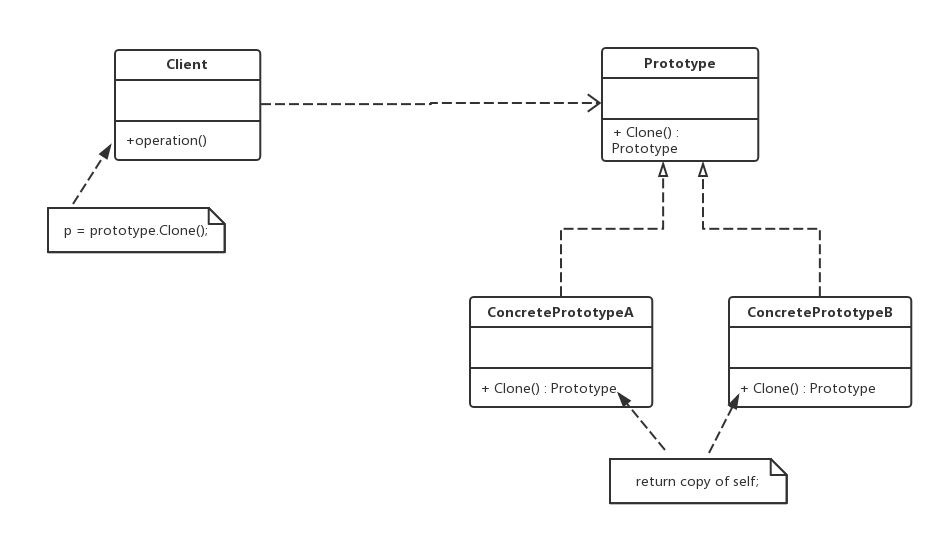

老版本问题：
1.除了允许用户创建新周报外，还允许用户将创建好的周报保存为模板（也就是原型）。
用户在再次创建周报时，可以创建全新的周报，还可以选择合适的模板**复制/克隆生成**一个相同的周报，
然后对新生成的周报根据实际情况进行修改，产生新的周报

原型模式（Prototype）：使用原型实例指定创建对象的种类，并且通过拷贝这些原 型创建新的对象。
原型模式是一种对象创建型模式，主要运用java的克隆
Prototype（抽象原型类）：它是声明克隆方法的接口，是所有具体原型类的公共父类，可以是抽象类也可以是接口，
甚至还可以是具体实现类。 
ConcretePrototype（具体原型类）：它实现在抽象原型类中声明的克隆方法，在克隆方法中返回自己的一个克隆对象 
Client（客户类）：让一个原型对象克隆自身从而创建一个新的对象，在客户类中只需要直接实例化或通过工厂方法
等方式创建一个原型对象，再通过调用该对象的克隆方法即可得到多个相同的对象
主要优点：
  1）当创建新的对象实例较为复杂时，使用原型模式可以简化对象的创建过程，通过复制一个已有的
  实例可以提高新实例的创建效率。
  2）可以使用深复制的方式保存对象的状态。将对象复制一份并将其状态保存起来，以便于在使用的
  时候使用，比如恢复到某一个历史状态，可以辅助实现撤销操作。
应用场景：
　　最主要的应用场景就在于 创建新对象成本较大（例如初始化需要占用较长的时间，占用太多的CPU资源
或者网络资源），新的对象可以通过原型模式对已有对象进行复制来获得。如果是相似对象，则可以对其成
员变量稍作修改
jdk:
java.lang.Object
protected native Object clone() 方法