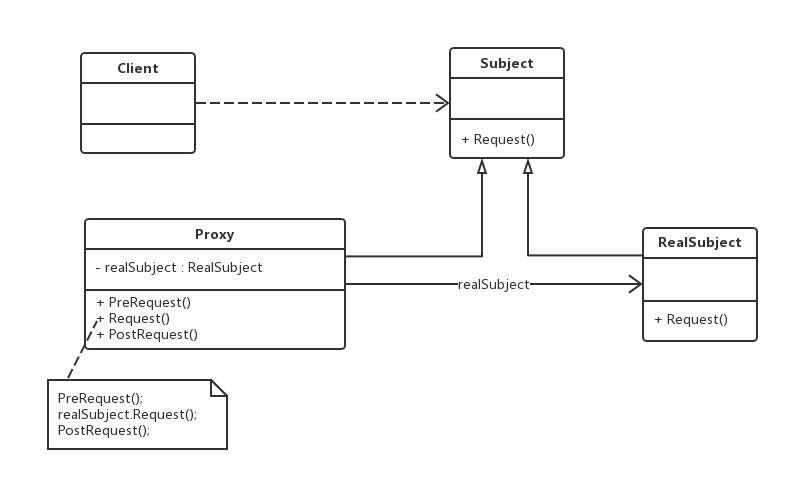

老版本问题：
1.给一个业务前后再加入业务，**类似AOP**,隐藏了前置后置的业务代码

代理（Proxy）模式：给某一个对象提供一个代理，并由代理对象控制对原对象的引用。代理模式是一种对象结构型模式
1）Subject（抽象主题角色）：声明真实主题和代理主题的共同接口，使得在任何使用真实主题的地方都可以使用代理主题
2）Proxy（代理主题角色）：代理主题角色内部包含了对真实主题的引用，从而可以在任何时候操作真实主题对象；
3）RealSubject（真实主题角色）：定义了代理角色所代表的真实对象，在真实主题角色中实现了真实的业务操作。
主要优点：
  （1）协调了调用者和被调用者，一定程度上降低了系统的耦合度 => 符合迪米特法则
  （2）客户端针对抽象主题角色编程，增加和更换代理类无须修改源代码 => 符合开闭原则
应用场景：
　　（1）客户端需要访问远程主机中的对象时 => 远程代理
  　（2）需要一个消耗资源较少的对象来代表一个消耗资源较多的对象 => 降低系统开销
  　（3）需要控制对一个对象的访问，为不同用户提供不同级别的访问权限 => 保护代理
jdk动态代理:(静态代理每个需要被代理的类都要写一遍，动态代理可以作为公共代理(需要
被代理的某一*类族*共用))
使用详见MyDynamicProxy.java
