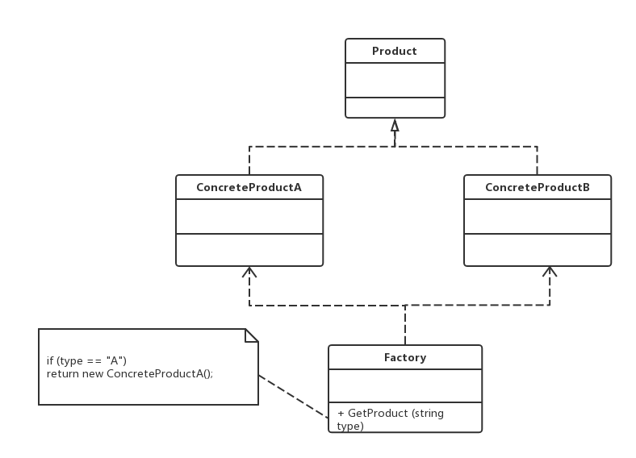

老版本问题：
public class Chart
    {
        private string type; // 图表类型
        public Chart(object[][] data, string type)
        {
            this.type = type;
            if (this.type.Equals("histogram", StringComparison.OrdinalIgnoreCase))
            {
                // 初始化柱状图
            }
            else if (this.type.Equals("pie", StringComparison.OrdinalIgnoreCase))
            {
                // 初始化饼状图
            }
            else if (this.type.Equals("line", StringComparison.OrdinalIgnoreCase))
            {
                // 初始化折线图
            }
        }
        public void Display()
        {
            if (this.type.Equals("histogram", StringComparison.OrdinalIgnoreCase))
            {
                // 显示柱状图
            }
            else if (this.type.Equals("pie", StringComparison.OrdinalIgnoreCase))
            {
                // 显示饼状图
            }
            else if (this.type.Equals("line", StringComparison.OrdinalIgnoreCase))
            {
                // 显示折线图
            }
        }
    }
1.Chart类的职责过重，负责初始化和显示各种图表对象，违反了单一职责原则；
2.当需要增加新的图表类型时，必须修改Chart类的源代码，违反了开闭原则；
3.客户端只能通过new关键字来直接创建Chart对象，Chart类与客户端类耦合度较高，
对象的创建和使用无法分离；
4.客户端在创建Chart对象之前可能还需要进行*大量初始化设置*，
例如设置柱状图的颜色和高度等，如果在Chart类的构造函数中没有提供一个默认设置，
那就只能由客户端来完成初始设置，这些代码在每次创建Chart对象时都会出现，
导致代码的重复；    

简单工厂（simple factory）模式：定义一个工厂类，它可以根据参数的不同返回不同类的实例，
被创建的实例通常都具有共同的父类。因为在简单工厂模式中用于创建实例的方法是静态（static）方法，
因此简单工厂模式又被称为静态工厂方法模式，它属于创建型模式
Factory - 工厂角色：该模式的核心，负责实现创建所有产品实例的内部逻辑，提供一个静态的工厂方法
GetProduct()，返回抽象产品类型Product的实例。
Product - 抽象产品角色：所有产品类的父类，封装了各种产品对象的共有方法，它的引入将提高系统的灵活性，
使得在工厂类中只需要定义一个通用的工厂方法，因为所有创建的具体产品对象都是其子类对象。
ConcreteProduct - 具体产品角色：简单工厂模式的创建目标，所有被创建的对象都充当这个角色的某个具体类
的实例
主要优点：
　　实现了对象创建和使用的分离：客户端可以免除直接创建产品对象的职责，而仅仅“消费”产品。
    客户端无须知道所创建的具体产品类的类名，只需要知道具体产品类所对应的的参数即可。
应用场景：
　　工厂类负责创建的对象比较少，由于创建的对象较少，不会造成工厂方法中的业务逻辑太过复杂。
    客户端只需要知道传入工厂类的参数，对于如何创建对象并不关心。
jdk:
Calendar.createCalendar