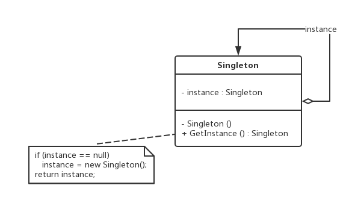

单例模式：确保某一个类只有一个实例，而且自行实例化并向整个系统提供这个实例，
这个类称为单例类，它提供全局访问的方法。
主要优点
　　由于在系统内存中只存在一个对象，因此可以节约系统资源，
　　允许可变数目的示例。基于单例模式，开发人员可以进行扩展，
使用与控制单例对象相似的方法来获得指定个数的实例对象，既节省系统资源，
又解决了单例对象共享过多有损性能的问题。例如，数据库连接池，线程池，各种池
适用场景
　　系统只需要一个实例对象。例如：系统要求提供一个唯一的序列号生成器或者资源管理器
　　客户调用类的单个实例只允许使用一个公共访问点，除了该公共访问点，不能通过其他途径访问该实例。
jdk使用
java.lang.RunTime类
public static Runtime getRuntime()
类功能：每一个运行的java应用都会有一个唯一的RunTime类的实例，
这个实例使得应用程序在运行期间能够受到运行环境的影响。