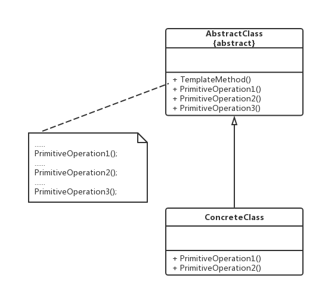

老版本问题：
public class Account
    {
        // 验证用户信息
        public bool Validate(string account, string password)
        {
            // 具体代码省略
        }
        // 计算利息
        public void CalculateInterest(string type)
        {
            if (type.Equals("Current", StringComparison.OrdinalIgnoreCase))
            {
                // 按活期利率计算利息，代码省略
            }
            else if (type.Equals("Saving", StringComparison.OrdinalIgnoreCase))
            {
                // 按定期利率计算利息，代码省略
            }
        }
        // 显示结果
        public void Display()
        {
            // 具体代码省略 
        }
    }
（1）系统可扩展性较差 => 如果需要增加一种新类型的用户，例如“小额贷款用户”，在系统中需要对应增加
一种新的利息计算方法，不得不修改Account类的源代码，在CalculateInterest方法中增加新的判断逻辑，违背
了开闭原则。
（2）客户端需要逐个调用Account类中定义的方法，而且需要了解这些方法的执行与否，否则容易出错 => 例如
Account类中的3个方法的次序为：Validate() => CalculateInterest() => Display()，如果不按次序调用，可能
会导致结果出错    

模板方法（Template Method）模式：定义一个操作中算法的框架，而将一些步骤延迟到子类中，模板方法使得
子类可以不改变一个算法的结构即可重新定义该算法的特定步骤。模板方法是一种行为型模式
（1）AbstractClass（抽象类）：在抽象类中定义了一系列基本操作（Primitive Operations），这些基本操作
可以是具体的，也可以是抽象的，每一个基本操作对应算法的一个步骤，在其子类中可以重新定义或实现这些步
骤。同时，在抽象类中实现了一个**模板方法（Template Method），用于定义一个算法的框架**。
（2）ConcreteClass（具体子类）：抽象类的子类，用于实现在父类中声明的抽象基本操作以完成子类特定算法
的步骤，也可以覆盖在父类中已经实现的具体基本操作。
主要优点
　　模板方法中可以通过子类来覆盖父类的基本方法，不同的子类可以提供基本方法的不同实现，更换和增加
新的子类很方便，符合单一职责和开闭原则
适用场景
　　（1）对一些复杂的算法进行分割，**将其算法中固定不变的部分设计为模板方法和父类具体方法，而一些可以
改变的细节由其子类来实现**。
  　（2）需要通过子类来决定父类算法中某个步骤是否执行，实现子类对父类的反向控制
jdk使用
java.util.AbstractList
ArrayList继承了AbstractList，没有覆写的方法在使用时，直接使用Abstract中
的方法