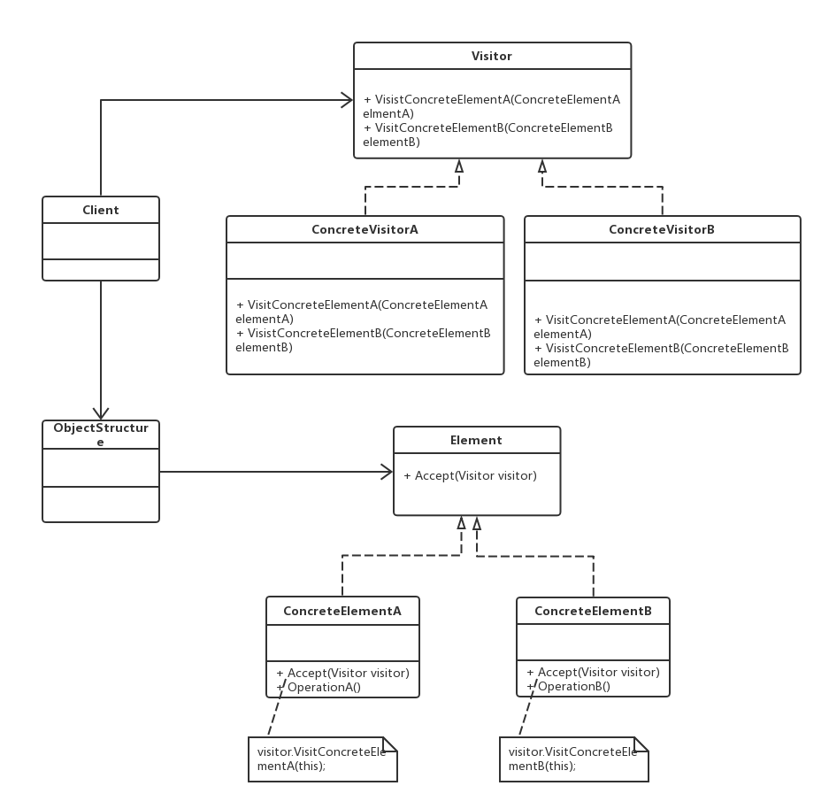

解决问题：**多个部门处理多个对象(多对多，虽是多个对象但是隶属于同一个集合)**
被访问元素通常不是单独存在的，它们存储在一个集合中，这个集合被称为“对象结构”
老版本问题：
class EmployeeList  {  
    private ArrayList<Employee> list = new ArrayList<Employee>(); //员工集合  
    //增加员工  
    public void addEmployee(Employee employee){  
        list.add(employee);  
    }  
    //处理员工数据  
    public void handle(String departmentName){  
        if(departmentName.equalsIgnoreCase("财务部")) //财务部处理员工数据  
        {  
            for(Object obj : list)  {  
                if(obj.getClass().getName().equalsIgnoreCase("FulltimeEmployee")) {  
                    System.out.println("财务部处理全职员工数据！");           
                }  
                else  {  
                    System.out.println("财务部处理兼职员工数据！");  
                }  
            }  
        }  
        else if(departmentName.equalsIgnoreCase("人力资源部")) //人力资源部处理员工数据  
        {  
            for(Object obj : list){  
                if(obj.getClass().getName().equalsIgnoreCase("FulltimeEmployee")){  
                    System.out.println("人力资源部处理全职员工数据！");                     
                }  
                else {  
                    System.out.println("人力资源部处理兼职员工数据！");  
                }  
            }             
        }  
    }  
} 
在代码中包含大量的“if…else…”条件判断语句，既需要对不同部门进行判断，又需要对不同类型的员工进行
判断，还将出现嵌套的条件判断语句，导致测试和维护难度增大

_方法实现上：访问者对每一个被访问者都有一个实现方法。每一个被访问者都有一个通用方法，输入参数为访问
者，此方法用于调用访问者的方法_
访问者模式(Visitor Pattern):提供一个作用于某对象结构中的各元素的操作表示，它使我们可以在不改变各元
素的类的前提下定义作用于这些元素的新操作。访问者模式是一种对象行为型模式。
（1）Visitor（抽象访问者）：抽象访问者为对象结构中每一个具体元素类ConcreteElement声明一个访问操作，
从这个操作的名称或参数类型可以清楚知道需要访问的具体元素的类型，具体访问者则需要实现这些操作方法，
定义对这些元素的访问操作。
（2）ConcreteVisitor（具体访问者）：具体访问者实现了抽象访问者声明的方法，每一个操作作用于访问对象
结构中一种类型的元素。
（3）Element（抽象元素）：一般是一个抽象类或接口，定义一个Accept方法，该方法通常以一个抽象访问者作
为参数。
（4）ConcreteElement（具体元素）：具体元素实现了Accept方法，在Accept方法中调用访问者的访问方法以便
完成一个元素的操作。
（5）ObjectStructure（对象结构）：对象结构是一个元素的集合，用于存放元素对象，且提供便利其内部元素
的方法。
主要优点
1）增加新的访问操作十分方便，不痛不痒，但是添加新的元素较为麻烦
2）将有关元素对象的访问行为集中到一个访问者对象中，而不是分散在一个个的元素类中，类的职责更加清晰
适用场景
**(1) 一个对象结构包含多个类型的对象，希望对这些对象实施一些依赖其具体类型的操作。在访问者中针对每
一种具体的类型都提供了一个访问操作，不同类型的对象可以有不同的访问操作。**
（2）对象结构中对象对应的类很少改变 很少改变 很少改变（重要的事情说三遍），但经常需要在此对象结构上
定义新的操作。
jdk使用
java.nio.file.FileVisitor接口
类功能：一个用于访问文件的接口。这一接口的实现类通过Files.walkFileTree方法实现对文件树中每一个文件
的访问。
public static Path walkFileTree(Path start,Set options, 
int maxDepth,FileVisitor< super Path> visitor) ，这一方法中回调了visitor的方法。